### Hi Folks 👋 
My name is Yueyang Pan. Currently I am pursuing my PhD at EPFL about computer systems and machine learning systems. I have faith in AGI, and I am actively embracing LLM to be integrated into my daily workflow. 
I like to learn how to harness AI power and build product which is infeasible for a single person in the previous era.
I also like to contribute to open source projects as I believe open source is the best way to amortize the infra cost. 
My personal website is https://panjason.github.io/. Have a look at it.

<!--
**PanJason/PanJason** is a ✨ _special_ ✨ repository because its `README.md` (this file) appears on your GitHub profile.

Here are some ideas to get you started:

- 🔭 I’m currently working on ...
- 🌱 I’m currently learning ...
- 👯 I’m looking to collaborate on ...
- 🤔 I’m looking for help with ...
- 💬 Ask me about ...
- 📫 How to reach me: ...
- 😄 Pronouns: ...
- ⚡ Fun fact: ...
-->
